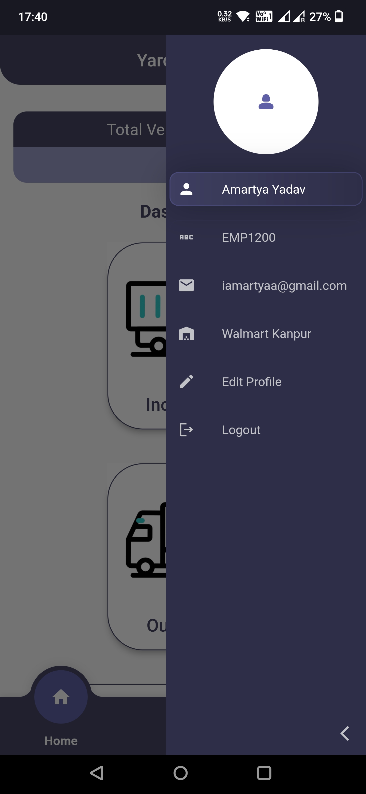
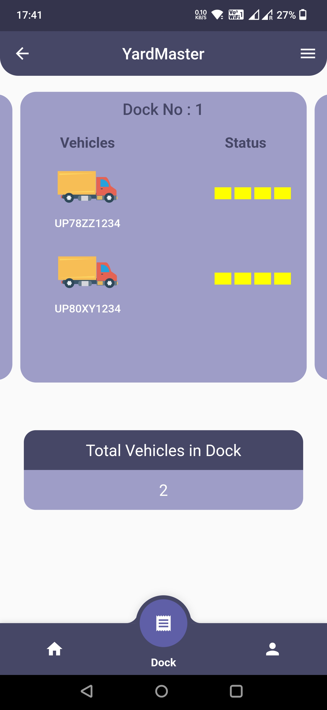
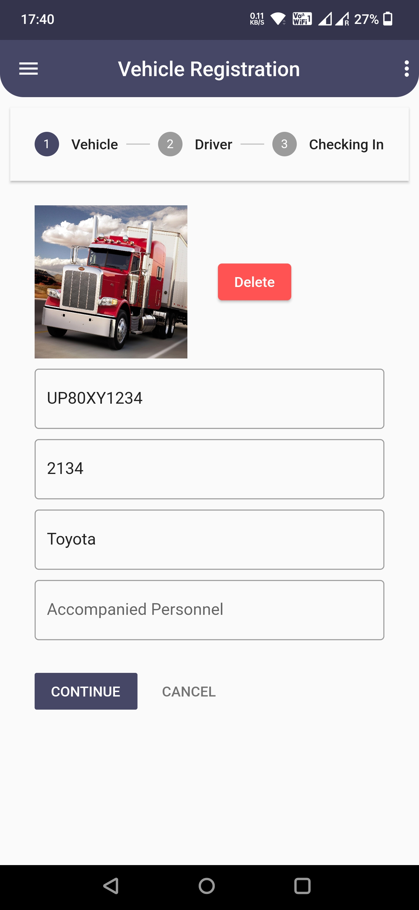

# YardMaster - Streamlining Yard Management for Walmart

 &ensp;  &ensp;
 &ensp;  &ensp;

## Introduction
Welcome to YardMaster, an innovative Yard Management System designed to optimize the efficiency of Walmart's supply chain operations. This repository hosts the complete codebase for YardMaster, offering a comprehensive solution to address the challenges faced in yard management.

## Problem Statement
In the fast-paced world of retail and logistics, managing the inflow and outflow of trailers and vehicles in the yard can be a daunting task. Manual paperwork, delays in vehicle registration, and inefficient allocation of resources can lead to operational bottlenecks and increased costs. YardMaster aims to tackle these challenges head-on.

## Theme
The theme of YardMaster revolves around digitizing and streamlining yard management processes. It empowers Walmart's logistics teams with real-time insights, predictive analytics, and automation to enhance operational efficiency.

## Solution Description

### Key Features
YardMaster offers a range of features designed to revolutionize yard management:

- **Swift Entry and Exit Management:**
   - Rapid vehicle and driver registration upon entry.
   - Instant QR code generation for efficient departure verification.

- **Smart Dock and Lot Allotment:**
   - Intelligent assignment of docking and parking slots.
   - Real-time adjustments based on demand and priority.

- **Real-time Yard Insight:**
   - A comprehensive dashboard for yard managers.
   - Quick search and filters for information retrieval.

- **Historical Tracking:**
   - Detailed historical records of yard activities.
   - Performance evaluation and trend identification.

### Tech Stack
YardMaster is built using the following technologies:

- **Frontend:** Flutter - A fast and expressive framework for building natively compiled applications for mobile.
- **Backend:** Firebase - A real-time cloud database and cloud storage for seamless synchronization.
- **State Management:** Provider Package - Ensuring efficient state management for a responsive user experience.
- **Authentication:** Firebase Authentication - Secure email authentication to protect user data.
- **Data Storage:** Firebase Cloud Storage - Scalable cloud storage for data management.
- **Real-time Communication:** Firebase Realtime Database - Ensuring real-time updates for seamless communication.

## Getting Started
To set up YardMaster locally and contribute to the project, follow the [Installation Guide](https://docs.flutter.dev/get-started/codelab).

## Contributions
We welcome contributions from the open-source community to improve YardMaster. If you have suggestions, feature requests, or bug reports, please submit them in the [Issues](link-to-issues) section.

## License
YardMaster is an open-source software licensed under the [MIT License](link-to-license).

## Acknowledgments
We would like to express our gratitude to the Nexus team and the open-source community for their support and contributions to YardMaster.

---

**Note:** For detailed installation instructions, configuration settings, and more, please refer to the [Documentation](https://docs.flutter.dev/).
